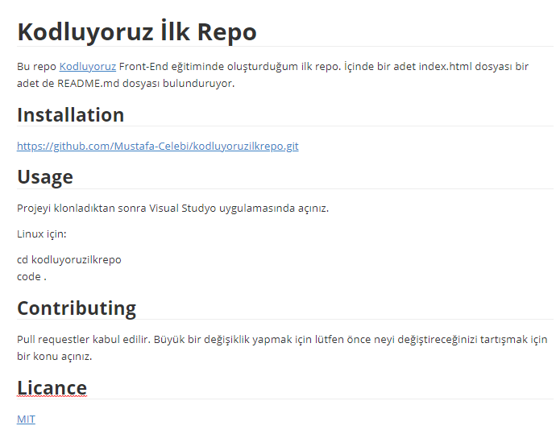

# Kodluyoruz İlk Repo

Bu repo [Kodluyoruz](https://kodluyoruz.org) Front-End eğitiminde oluşturduğum ilk repo. İçinde bir adet index.html dosyası bir adet de README.md dosyası bulunduruyor.

## Installation

https://github.com/Mustafa-Celebi/kodluyoruzilkrepo.git

## Usage

Projeyi klonladıktan sonra Visual Studyo uygulamasında açınız.

Linux için:

cd kodluyoruzilkrepo
code .

## Contributing

Pull requestler kabul edilir. Büyük bir değişiklik yapmak için lütfen önce neyi değiştireceğinizi tartışmak için bir konu açınız.

## Licance

[MIT](https://github.com/Mustafa-Celebi/kodluyoruzilkrepo/blob/main/LICENSE)

